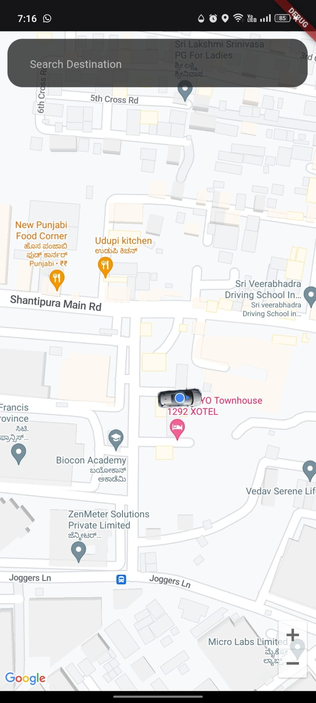
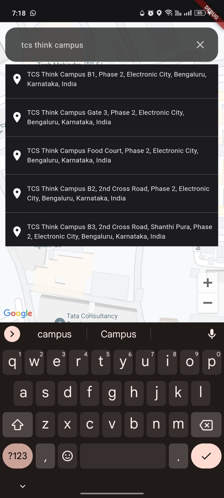
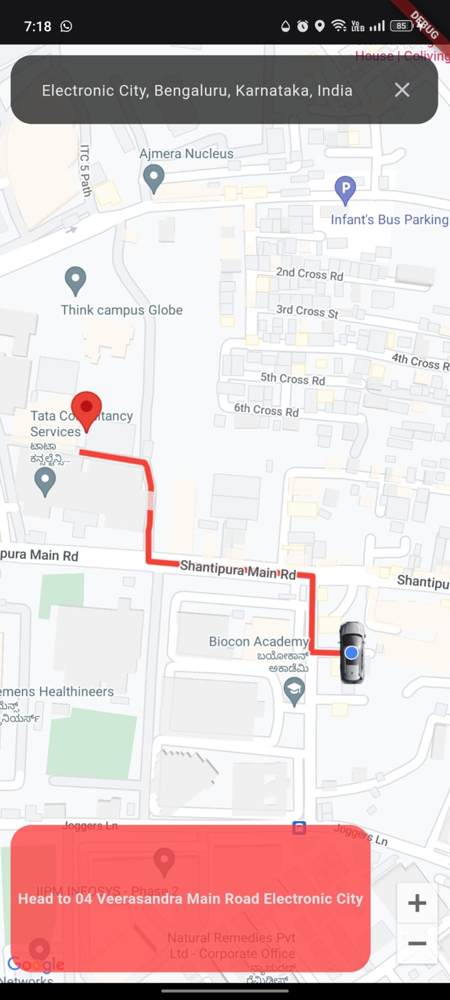

# Flutter Google Maps Navigation App

This Flutter app allows users to select a destination and navigate to it using Google Maps. It provides a simple and intuitive interface for users to input their desired destination and get turn-by-turn directions.

## Features

- **Select Destination**: Users can input their desired destination using text input.
- **Google Maps Integration**: Utilizes the Google Maps API for displaying maps and providing navigation.
- **Turn-by-Turn Directions**: Provides users with turn-by-turn directions to their selected destination.
- **Simple UI**: Designed with a clean and user-friendly interface for easy navigation.
- **State Management with BLoC**: Implements state management using the BLoC pattern for better organization and separation of concerns.

## Getting Started

To get started with this app, follow these steps:

1. Clone this repository to your local machine.
2. Open the project in your preferred IDE or text editor.
3. Ensure you have Flutter and Dart installed on your system.
4. Run `flutter pub get` to install dependencies.
5. Connect your device or emulator and run `flutter run` to launch the app.

## Screenshots

*Landing Page*

*Select the destination*

*Navigating to the destination*

## Release Build

You can find the release build of this app in the `build\app\outputs\flutter-apk` folder.

## Usage of BLoC Method

This app utilizes the BLoC (Business Logic Component) pattern for managing application state. Here's how it works:

- **Bloc Class**: The `HomeBloc` class manages the state related to the home screen, including fetching the current location and handling events such as selecting a destination.
- **Events**: Various events, such as `FetchcurlocationEvent`, trigger state changes within the `HomeBloc`. For example, when the user selects a destination, a `DestinationSelectedEvent` is dispatched to the `HomeBloc`.
- **States**: The `HomeBloc` emits different states based on the events it receives. For example, when the current location is fetched successfully, a `FetchcurlocationState` containing the location data is emitted.
- **UI Integration**: The UI components subscribe to the `HomeBloc` to receive state updates. For example, the map screen listens to changes in the `HomeBloc` to update the displayed location or destination.

By using the BLoC pattern, the app maintains a clear separation of concerns, making it easier to manage and scale as the application grows.